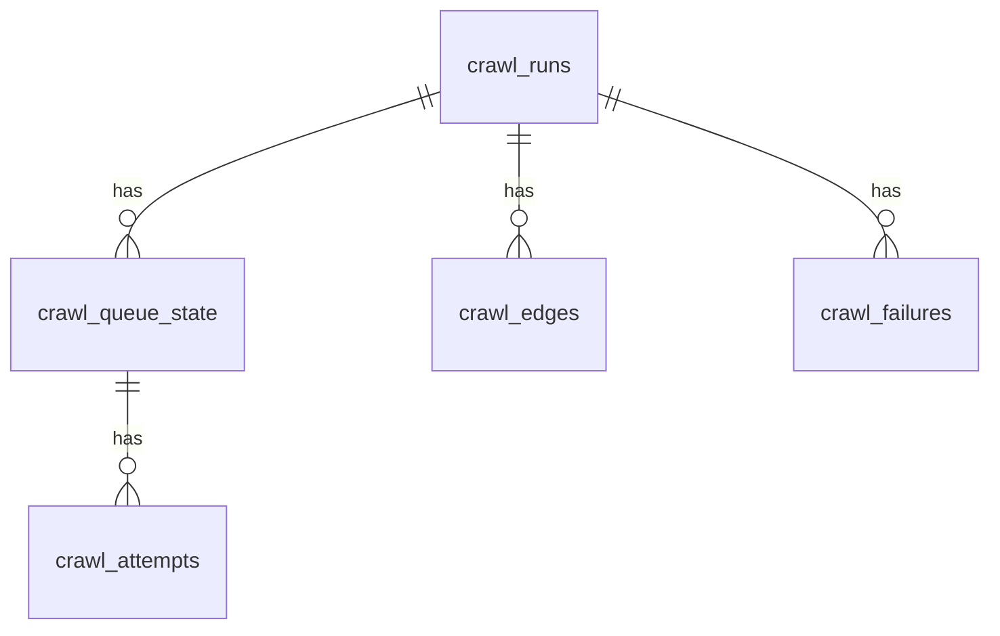

# Queue Log Schema Overview

## Relationship Diagram

## Table Roles

### crawl_runs
- 1回のクロール実行を表します。
- `root_seed_count`: 実行開始時の種URL数
- `notes`: 実行メモ

### crawl_queue_state
- URLごとの現在状態を表します。
- `run_id` で `crawl_runs` に紐づきます。
- `status`, `depth`, `retry_count`, `started_at`, `finished_at` などを持ちます。

### crawl_attempts
- 1 URL に対する取得試行の履歴です。
- `queue_state_id` で `crawl_queue_state` に紐づきます。
- `ok`, `status_code`, `error_type`, `error_message`, `connection_log` を持ちます。

### crawl_edges
- 親URLから子URLを発見した関係を表します。
- どのページからどのページへ辿ったかを保存します。

### crawl_failures
- 失敗ログをまとめて残す軽量テーブルです。
- `QUEUE_LOG_FAILURES_ONLY=1` のときに主に使います。

## Write Flow

1. `dispatcher.py` が `QueueLogStore` を作成します。
2. `create_run()` で `crawl_runs` に 1 行作ります。
3. `upsert_queue_state()` / `add_attempt()` / `add_edge()` がメモリバッファに積まれます。
4. `flush()` でまとめて PostgreSQL に書き込みます。
5. `finish_run()` で `crawl_runs` の終了状態を更新します。

## Notes

- この構成は「実行単位の親 + 状態 + 履歴 + 関係 + 失敗」を分けて管理する設計です。
- まず Markdown として保存し、必要ならあとで PNG / SVG にもできます。

---------------------------------

大学認定サイト監視クローラー

認定データを監視し、シードURLを取得することを目的とする

認定データURL→大学名→検索API→シードURL→抽出ワークフローのシードURLに追加

認定サイト
↓
大学発見
↓
既知？
↓ yes
無視

↓ no
Seed投入

ーーーーーーー
１．seed_observer
(大学認定サイトを監視 また、ここが情報を持っているためログ記録も担当する方が良いと思っている) 

２．observe_supervisor
（１サイトごとに監視しているworkerを管理する）

３．seed_searcher
（検索APIを用いてsupervisorから渡ってくる情報から検索　大学サイトを見つける　なるべくここでコース一覧ページを見つけたい　検索結果をここで軽く探索したりsitemap見てコース一覧のURLを見つけるのも良い） 

2.5．observe_dedupe
重複データを監視して、既存の情報をsearcherに渡さないようにすることでAPI使用料等を節約する。×
　既存 seed_urls のユニーク制約は (domain, root_url) です。そのため dedupe は root_url 単位で判定するのが自然ですが、同一ドメインの別パス（例：/undergraduate と /postgraduate）は別レコードとして許容される設計です。これが意図通りか確認が必要です。

４．seed_transformer
(supervisorから渡ってくるURLを整形してシードURLDBへ投入できる形へ変換　ここで、３の段階でコース一覧ページ等の物が見つかっていた場合はdepthを１等浅く、見つかっていなかった場合は少し深くして探索するプログラムにする必要がある。）
　コース一覧ページが見つかった場合に depth を浅くする設計ですが、dispatcher.py の build_site_states() は 同一ドメインの複数URLを束ねて max_depth を最大値で統一します（dispatcher.py:32）。
つまり同一ドメインに depth=1 と depth=3 の URL が混在すると、depth=3 が採用されます。浅い URL だけ depth を下げても効果が薄い点に注意が必要です。
  

５．seed_adder
（４で整形されたデータをDBへ投入する。　将来DBが変わったりした場合でも変更しやすいように４と分けとこうかと思っている。)
→init_seed_db.pyのupsert_targets()がそのまま使えるらしい。引数は変える必要がある。
init_seed_db.py:11 の infer_country() はTLDベースの簡易判定です。新しく発見した大学URLが .com や .org の場合 "unknown" になります。seed_transformer 側で検索API結果から国情報を付与しておき、seed_adder に渡す設計にしておく方が良いです。

１，２　同期
３　非同期
--------------
データクラス一つを、各ステップに応じて徐々に埋めていくという方針に

既存シードURL
　id
  country
  domain
  root_url
  depth(depth >= 0)
  enabled (0or1)
  created_at(datetime('now')),
  updated_at(datetime('now')),
  UNIQUE(domain, root_url)

「データクラス一つを各ステップで徐々に埋める」方針の場合、seed_observer → supervisor → searcher → transformer のパイプラインを通る間に埋まるフィールドが明確になっていないと、transformer で depth 決定に必要な情報（コース一覧URLが見つかったか否か）が欠落するリスクがあります。searcher の出力にそのフラグを含めることを明示的に設計しておく必要があります。

まとめ（優先度高い順）
#	問題	対応箇所
1	build_site_states が同ドメインの depth を max で統一する	seed_transformer の設計時に意識
2	depth 決定に必要な情報をデータクラスに含める	データクラス設計
3	seed_adder の入力型を upsert_targets に合わせる	seed_adder 実装
4	.com/.org ドメインの国情報を searcher 段階で補完	seed_transformer or searcher
5	schedular との実行タイミング調整	運用設計

データクラス案
　・URL（ドメイン）
　・シードURLリスト
　・depth
　・depth決定に必要な、ＵＲＬ意味推定orキーワードリストorＤＯＭから推定できるＵＲＬ一覧のコースっぽさ判定（中身まで見ると時間がかかるし役割がかぶるからＵＲＬからの推定にとどめる）
　　→キーワードリスト、ＤＯＭから推定されるそれっぽさスコア（ＤＯＭまで保存しなくてよい）

depth設定は、検索時のサイトマップか検索で有力なコース候補が見つかった場合は1~2,そうでない場合は３とかにしてシードＵＲＬに登録するのが良いのではないか

@dataclass
class SeedDiscovery:
    domain_url: str
    seed_urls: list[str] = field(default_factory=list)
    depth: int = 3

    seed_candidates: dict[URL:seedscore(それっぽさ)] = field(default_factory=list)　

    source_site: str | None = None
    university_name: str | None = None

course_keywords: list[str] = field(default_factory=list)はプログラム側で持つ
タイトル
URL
スニペット
から、シードＵＲＬっぽさをスコアリング

ここでいうスニペット（snippet）は、
検索結果に表示される説明文のことです。（検索APIが返したりするらしい）
最初に試してみたいのは、

検索APIが実際にどこまでタイトルやスニペットを返してくれるかですね。APIによってはURLしか返さないものもありますし、逆にかなり質の良いスニペットを返してくれるものもあります。そうすると設計がかなり変わります。

    #HTMLから取れる場合
        #例: TABLEタグが多い → TABLE_LIST 
            #tr>tbody>table といった数と思われる
            #table関連タグが多い場合、tableタグの中身を見て、～大学、~University、～College、～Institute などの文字列が含まれるかを確認する
            #aタグ、trタグ等、色々なタグの中にある場合があると思われるので、tableタグの中身を見て文字列判定の方が精度が高いと思われる
        #検索フォームと判定 → SEARCH_FORM
            #divタグに serarch という文字列が含まれたタグが多い　その数で判定して、何も選択せず検索ボタンをクリックさせ、大学一覧を出す
            #検索フォームから飛んだ大学詳細ページ → PROFILE
                #詳細ページもtablelistだったりする　その場合はtablelistとする
                #そうでない場合をsearch_formとして、あとから自分で調べてクローラー改善の足しにする
#PDFから取れる場合 →　PDF
PDFには3種類ある
1. テキスト埋め込みPDF → pdfplumberで取れる
2. 表PDF → pdfplumber / camelot / tabula が候補
3. 画像PDF → OCRが必要

今回は３は非対応とする

1. PageType判定
2. candidate_lines抽出
3. university_name正規化
4. 検索API接続

検索APIの利用回数に制限はあるので、1回リクエスト後にヒットしなかったら違う検索ワードで再検索　というフォールバック？が必要ですね。

１．公式ドメイン発見用検索→２．APIから得られたURLを探索、大学コース一覧サイトがあるか否か判定→3.なければ、depthを深め(3とか）に設定して渡す。コース一覧があれば、depthを浅く(1or2)にして渡す。

2.5として、もう一度検索APIから、公式サイト　コース一覧　のように検索してみてもよいかもしれないとは思わなくもありませんが。

クエリ生成は seed_searcher.py:278 で実施
検索API呼び出しは seed_searcher.py:350 で同期実行
URL探索は seed_searcher.py:203 で非同期実行
ただし探索は「取得したページ自身の判定」で、内部リンクを収集して次に辿る処理はまだない
判定結果の保持は dataclass.py:242
あなたの提案フローへの意見

公式ドメイン発見用検索
返却URL探索でコース一覧有無判定
なければ depth を深く、あれば浅くして渡す
これはとても良いです。実運用に強いです。
2.5 の再検索について
結論として「条件付きで有効」です。
API制限があるなら、無条件再検索は避けて、次の条件でだけ実行するのが最適です。

1回目で公式ドメインが確定しない
または公式ドメインは見えたが course_list_detected が立たない
かつ、URL探索でコース候補リンクが十分に得られない
このときだけ 2回目検索を実施すると、精度とコストのバランスが良いです。

推奨する実装方針

第1段階は大学名のみ中心で検索して公式ドメイン確定を優先
公式トップが見つかったら、そのページから内部リンク抽出して courses/programmes/undergraduate/postgraduate 系だけ非同期探索→これで見つかるのか？
それでも弱い場合のみ第2段階検索として site:公式ドメイン + courses/programmes を1回だけ実行
最終的に course 一覧が見つかれば depth 1-2、見つからなければ depth 3
この設計だと、あなたの責務定義にぴったり一致します。